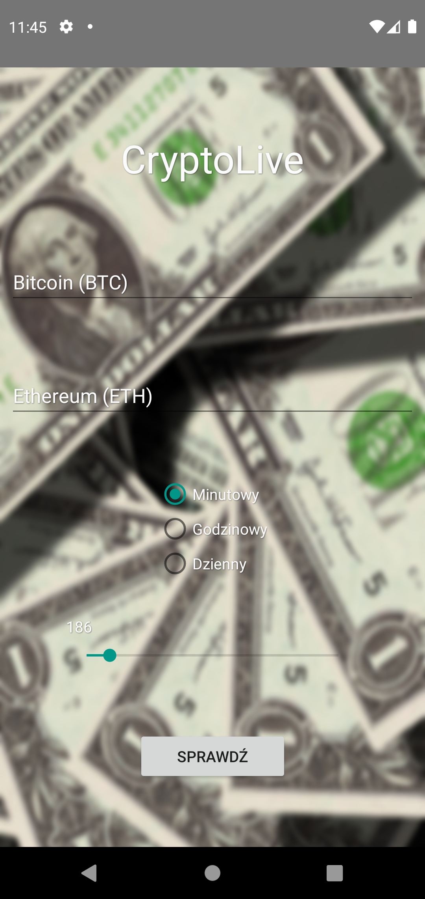
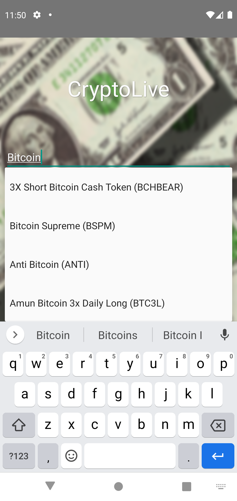
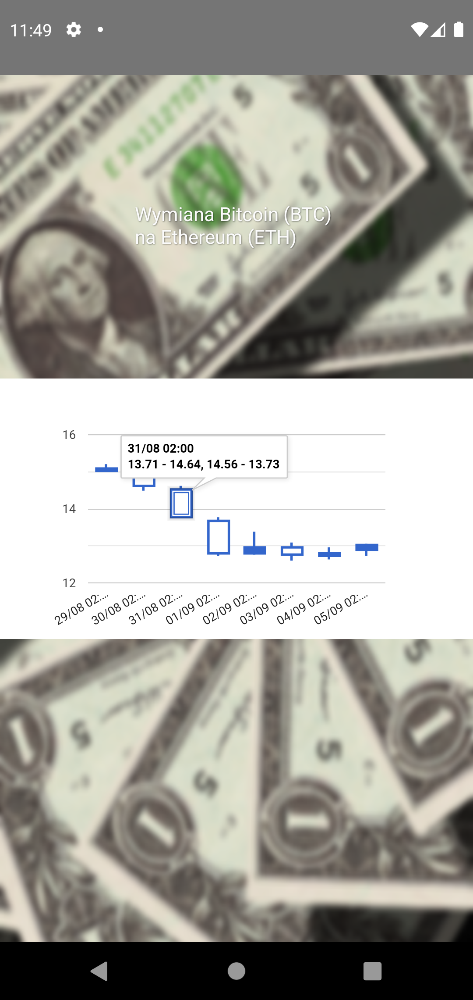

# Live Crypto
### Mobile application for tracking cryptocurrency prices.

The goal of this project is to create mobile application for Android that allows users to track cryptocurrency prices.

Cryptocurrency prices are collected from [CryptoCompare API](https://min-api.cryptocompare.com/).

## Getting Started

### Prerequisites

* Android SDK
* Android Studio - https://developer.android.com/studio/

Detailed information about installation and configurations are provided at developers' site.

## Technology Stack

* Android
* Java
* SQLite
* Google Charts - https://developers.google.com/chart
* JavaScript

Google Charts are embedded into the application using WebView.

## Preview

<table>
    <tr>
        <td>
            
Homepage

            
        </td>
        <td>
            
Cryptocurrency Selector

            
        </td>
        <td>
            
Cryptocurrency Exchange Chart

            
        </td>
    </tr>
</table>

## Author

* **Michał Koziara** 
